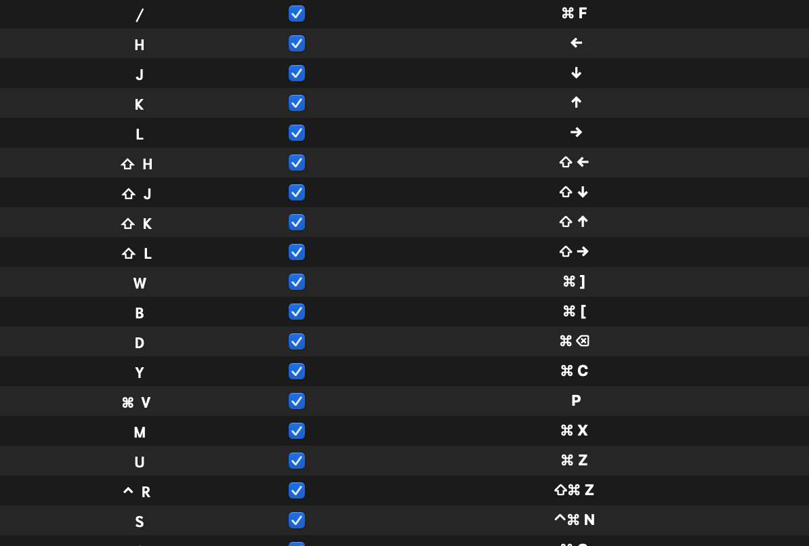
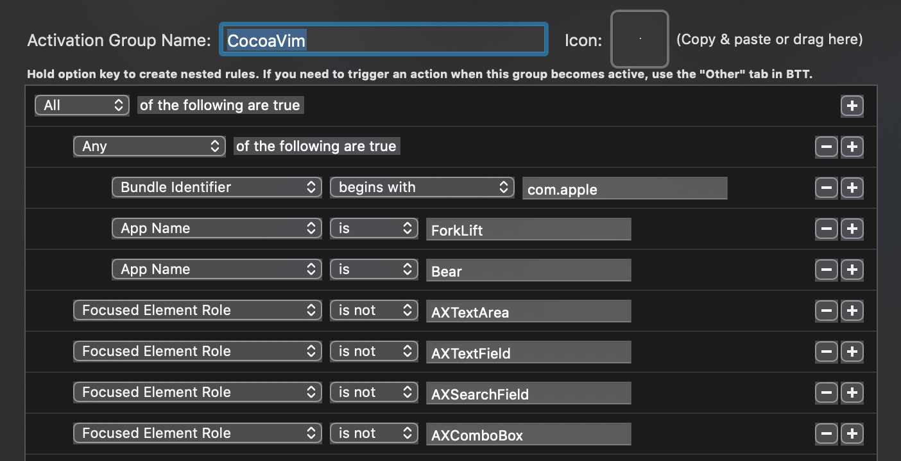
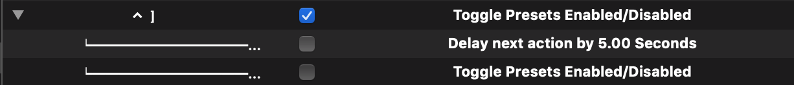

# CocoaVim
## What is it?

A set of keybindings to mimic Vim behavior in any Cocoa-based app you desire!

## How does this work?

This preset is built on a conditional group that only activates when you’re in a whitelisted app AND your focus isn’t on a text field. 

## Caveats

BetterTouchTool doesn’t recognize Spotlight and other ‘floating’ apps like Alfred, so if you trigger it when inside a whitelisted app,  you won’t be able to type any of the keys assigned to CocoaVim. The workaround I’ve come up with is a BTT shortcut to temporarily disable the preset for a few seconds.
